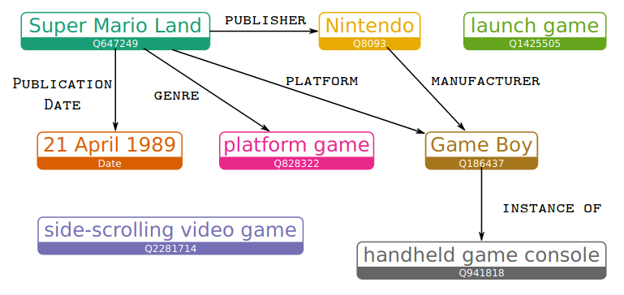
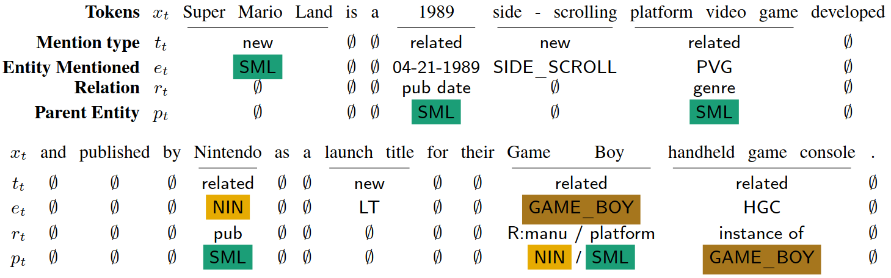

# Overview

::: columns
:::: column
- Language modelling
- - Fact completion
- - Slot filling
- - Explicit information access
- Knowledge graph language model
- - Definition, Example
- - Computation
- - Training and inference
- Experiments
- - Language modelling
- - Fact completion
- Summary
- Future work
- Discussion
::::
:::: column
$\ $
::::
:::

# Language Modelling

\begin{block}{Task}
Language modeling is the task of predicting the next word or character in a document.

\begin{gather*}
p(x_t|x_{< t})
\end{gather*}
\end{block}

. . . 

Approaches:

- n-grams $p(x_t|x_{(t-H):t})$
- LSTM/GRU
- GPT
- BERT

::: notes
- Language modeling is a task that boils down to predicting the next word in a sentence.
- There are numerous approaches to it, ranging from n-grams to transformers.
- This has applications in for example information retrieval, but it can also be used as a proxy task for pre-training BERT.
:::

# Language Modelling

Next word prediction:

- `Super Mario Land is a 1989 video game developed and ____`

. . .

Fluency:

- `Super Mario is a 1989 video game developed and published by ____`

. . .

Adequacy / Basic reasoning:

> - `Super Mario is a 1989 video game developed and published by Valve`
> - _Valve_ is an entity that could potentially develop and publish a video game
> - Founded in 1996    

. . .

Factual correctness:

- `Super Mario is a 1989 video game developed and published by Nintendo`

::: notes
- Next word prediction is the main part of language modelling.
- We may be interested in Fluency and Adequacy.
- Both of these fillings look ok. _Valve_ is a game development company, so that works as well.
- - Unfortunately, it was founded in 1996, so they could not have made a 1989 game.
- Therefore, we may be interested in explicit factual correctness.
:::

# Language Modelling

Factual correctness (Barack's Wife Hillary):

- Query: `Super Mario is a 1989 video game developed and published by`
- Answer: `Nintendo`
- Context: KG

. . .

Slot Filling (KILT [2]):

- Query: `Super Mario | published_by`
- Answer: `Nintendo`
- Context: Documents

::: notes
- The paper KILT also introduces a task that's similar to factual correctness, but in a sense easier, because it explicitly mentions the first entity and the relation.
- The approaches are however quite complementary, because the first one requires knowledge graph to answer a more complex natural language query, while the second one has access only to a collection of documents to answer a simpler, more structured query.
:::

# Language Modelling

Achievements:

> - Fluency? Yes - even n-gram models
> - Adequacy? Yes - BERT derivatives
> - Factual correctness?
> - - BERT derivatives (stored in the parameters)
> - - Explicit information structure (KG)

::: notes
- The way we can achieve fluency is even with sufficiently good n-gram models.
- Adequacy is more trickier, but it works reasonably well with BERT and similar models.
- Factual correctness works partly with BERT, but it's not performant enough.
- Explicit information storage is the motivation for this whole paper.
:::

# Explicit information access

Advantages:

> - Language model and database separate \newline
    adding information without retraining LM 
> - Performance on unseen/rare entities
> - Explainability

. . .

Control:

> 1. Prompt: `Barack is married to ___`
> 2. Response: `Barack is married to Michelle`
> 3. *Change the entity in the KG
> 4. Response: `Barack is married to Hillary`

. . .

Disadvantages:

- Research and mass adoption missing
- Two components to setup and maintain

::: notes
- A big advantage is being able to modify facts after the language model training. This is not possible for standard language models, because the facts are stored in the trained parameters (in their generative ability). With separate structures, it is possible to verify that changing the relevant entry will yield different generative results.
- Generating unseen or rare entities is more problematic in standard LM models, because the conditioning is not strong enough. This is less of an issue if frequent and infrequent entities are represented the same way in the external structure.
- The motivation for explainability is clear: it is simply better if we know exactly where is the information coming from and reduce the size of the black box mechanism.

- Control is something not immediately useful in LM, but maybe in downstream tasks. It also neatly shows the dependence between the model and the knowledge base.

- Disadvantages are that the systems are generally more complex and that there is subsequently less research done.
:::

# Knowledge Graph Language Model

::: columns
:::: column
Components:

- Standard language model
- External knowledge graph
- Local knowledge graph (subset of ^) 
- - For mentioned entities
::::

. . .

:::: column
Actions:

- Not an entity
- Generating new entity:
- - Access external
- - Add to local
- - Render
- Generating encountered entity
- - Access local
- - Render
::::
:::

::: notes
- Standard LM, like BERT, which will be slightly modified
- External knowledge base
- - From which we will keep a subset, called local knowledge graph

- At every token the model can decide between three actions:
- Not an entity - fallback to standard model
- Generate new entity - retrieves the entity from the external graph
- Generate a related entity - can be found in the local graph
:::

# LM + KG

Standard LM: \newline
  $p(x_t|x_{< t}) = \text{softmax}(W_h h_t + b_h), h_t = \text{LSTM}(h_{t-1},x_{t-1})$

. . .

Knowledge graph: \newline
  $\mathcal{KG} = \{(\text{parent}, \text{relation}, \text{entity})| \text{parent, entity} \in \mathcal{E}, \text{relation} \in \mathcal{R}\}$

. . .

Local knowledge graph: \newline
  $\mathcal{KG}_{< t}$ entities participating in first $t$ tokens

. . .

LM + KG: \newline
  $p(x_t, \mathcal{KG}_t|x_{< t}, \mathcal{KG}_{< t})$

. . .

Decision/type of token $t: t_t \in \{\emptyset, \text{new}, \text{related}\}$

::: notes
- Explain variables
- - $x_t$: current token
- - $x_{< t}$: token history
- - $W_h$: projection matrix
- - $h_t$: hidden state
- - $\mathcal{KG}_t$ current local graph iteration
- Knowledge graph is just a set of triplets with ordered relations. One of the entities we call the parent.
- Standard LM models output just the word, but the LM over KG also tries to predict the current local graph.
- - At every point in the sentence, it makes a decision regarding the current word.
- - Either it's not an entity, or it's a new entity or it's an entity already in the local graph.
:::

# LM + KG

Decision/type of token $t: t_t$

- $t_t = \emptyset$: choose $e_t = \emptyset$

. . .

- $t_t = \text{new}$: choose $e_t \in \mathcal{E}$

. . .

- $t_t = \text{related}$: \newline
    choose $\text{parent}_t \in \mathcal{E}_{< t}$ \newline
    choose $\text{relation}_t \in \{r|(\text{parent}_t, r, e) \in \mathcal{KG}_{< t}\}$ \newline
    choose $\text{entity}_t \in \{e|(\text{parent}_t, \text{relation}_t, e) \in \mathcal{KG}_{< t}\}$
  
. . .

Update local KG: $\mathcal{E}_{< t+1} = \mathcal{E}_{< t+1} \cup \{e_t\}$

::: notes
- Explain variables
- - $t_t$ current decision/type of the current entity
- This slides just formalizes the entity decisions.
- If it's unrelated, we just set the current entity to some special undefined symbol.
- If it's new, we draw a new entity from the external graph.
- If it's local, we first choose the parent, then from the available relations and finally from the list of entities.

- Finally, at the end we update the local knowledge graph to the next timestep.
:::

# Linked WikiText-2

::: columns
:::: column
1. Entity recognition
2. Coreference using Stanford CoreNLP
3. Wikipedia links + neural-el entity linker
4. Rule-based post-processing (dates, quantities)
5. Sequentially parse tokens and create local KGs
::::

:::: column
{width=95%}
::::
:::

::: notes
- The image on the right shows the local graph for the Super Mario Land sentence. We can clearly see that it's just an oriented graph with named edges. Furthermore, there can be multiple edges between two entities.

- The process of creating LinkedWikitext 2 is the following
- The gold labels are of course the manual links provided by the editors. They are however only provided for the first occurrence of that entity. So coreference tool is used and also entity recognition for things like dates.
- They also use a few rule based tricks to better capture dates and quantities.
- The sequential local knowledge graph is created by considering all neighbours of an entity when it is encountered. And if some other entity appears later, it is the child of the first one.
:::

# Example

{width=100%}

::: notes
- The example annotation shows the sentence with Super Mario Land.
- In the first step, the entity Super Mario Land is a new entity, the next two tokens are not entities and the next one is a related entity. 
:::

# Computation - Picking $e_t$

$h_t = [h_{t,x};h_{t,p};h_{t,r}]$\newline
$t_t = \text{softmax}(W_t h_{t,x} + b_t)$ 

. . .

$t_t = \text{new:}$

- $e_t = \text{softmax} (v_e\cdot (h_{t,p}+h_{t,r}))$

. . .

$t_t = \text{related:}$

- $p_t = \text{softmax}(v_p\cdot h_{t,p})$
- $r_t = \text{softmax}(v_r\cdot h_{t,r})$ (restricted by $p_t$)
- $e_t \in \{e|(\text{parent}_t, \text{relation}_t, e) \in \mathcal{KG}_{< t}\}$

. . .

\texttt{QUESTION}: What if $\{e|(\text{parent}_t, \text{relation}_t, e) \in \mathcal{KG}_{< t}\} = \emptyset$?

::: notes
- The way these decisions are made is that we artificially split the hidden state into three parts, with the first one being the decision.
- If we want a new entity, it's done by a projection of the sum of the parent and relation part.
- If we want a related entity, we first choose the parent with a projection vector and a relation. Then we get all possible entities that match the parent and the relation and select an entity. 
- Ideally, the combination of parent and relation fully determines the entity. If there are multiple, one is chosen at random.
- QUESTION: The paper does not mention what happens if this set is empty. Probably fallback to LM? Or act as if entity is new?
- Note to self: The related entity is drawn from the local graph. We add the parent entities but also the relations and their children.
:::

# Computation - Rendering $e_t$

$e_t = \emptyset$:

- standard LM ($softmax(W_h h_t + b)$)

. . .

$e_t \in \mathcal{E}$:

> - $h_t' = W_\text{proj}[h_t;v_{e_t}]$
> - $p_\text{orig}(x_t = w_t) = softmax (W_h h_t' +b)$
> - $p_\text{alias}(x_t = a_j) \propto \exp \big[\sigma\big( {h_t'}^{T} W_\text{copy}\big)\cdot a_j\big]$

. . .

Marginalize $p(x_t) = \sum_{\mathcal{E}_t} p(x_t, \mathcal{E}_t)$

::: notes
- If there is no entity to render, we use a standard model.
- If there is one, we concatenate the hidden state with the embedding of the entity and then do softmax over the original distribution and also the alias distribution.

- For perplexity we care about the probability of the produced token, therefore we marginalize the distribution.
- This may not be obvious why we do it, but the construction of the local graph is also statistical. So even though we could still just take the argmax at every step, that would not be the correct distribution as described by this model. Therefore we need to marginalize by all possible local graphs. Later we will see how to approximate this.
:::

# Training, Inference

Training:

::: columns
:::: column
- Loss function: $\sum_t \log p(x_t, \mathcal{E}_t | x_{< t}, \mathcal{E}_{< t}, \Theta)$
- \texttt{QUESTION}: Why not $-$?

. . .

- Marginalize over parents
::::
:::: column
{width=100%}
::::
:::

. . .

Inference

- $p(x) = \sum_\mathcal{E} p(x, \mathcal{E})$ hard to compute
- $p(x) = \sum_{\mathcal{E}} \frac{p(x_t, \mathcal{E}_t)}{q(\mathcal{E}_t|x_t)}\cdot q(\mathcal{E}_t|x_t) \approx \frac{1}{N} \sum_{\mathcal{E} \sim q} \frac{p(x_t, \mathcal{E}_t)}{q(\mathcal{E}_t|x_t)}$ 

::: notes
- The training is quite straightforward, because we know the target distribution, so we just maximize the log probability.
- QUESTION: It's negative log likelihood, why does the formula in the paper not have $-$? It makes more sense, since we want to maximize the probability.

- $q$ is a proposal distribution made by a model, that just predicts the parents, entities and relationships given the unmasked token, which is an easier task.
- This process is called importance sampling.
:::

# Pretrained Embeddings

$p$-parent, $r$-relation, $e$-entity\newline
$p'$-randomly sampled entity, $e'$-randomly sampled entity,

. . .

$\delta(v_p, v_r, v_e) = ||v_p + v_r - v_e||^2$

. . .

Hinge loss (extended): $\mathcal{H} = \sum_{y\ne t} \max (0, 1+w_y x - w_t x)$

. . .

For embeddigs: $\mathcal{L} = max(0, \gamma + \delta(v_p, v_r, v_e) - \delta(v_{p'}, v_r, v_{e'}))$

::: notes
  - For the pretrained embeddings, the authors use modified hinge loss.
  - Normally it's summed over all possible classes, which is not possible here. So two random entities are used to prevent collapses (in that case $\mathcal{L} = \gamma$).
:::

# Experiments - Language Modeling

Perplexity

- geometric average probability of the all data: \newline
  $p(x_1, x_2, x_3, \ldots)^{1/T} = exp(\frac{1}{T} \sum_1^T \log p(x_t))$

Unknown penalized perplexity

> - What about `<UNK> <UNK>'s wife is <UNK> <UNK>`?
> - $\mathcal{U} = \{t|f(t) =\texttt{<UNK>}\}$
> - $p'(\texttt{<UNK>}) = \frac{1}{|\mathcal{U}|} p(\texttt{<UNK>})$
> - Compute perplexity on $p'$

::: notes
  - Standard perplexity is not the best metrics for texts containing named entities: predicting unknown/unseen words as `<UNK>` yields good results, even though no information is transferred.
  - Solution would be to penalize predicting `<UNK>` more than other tokens.
  - Distribute the predicted probability among all tokens that map to `<UNK>`
:::

# Experiments - Language Modeling

\centering 

||PPL|UPP|
|:-|:-:|:-:|
|EntityNLM (Ji et al., 2017)|85.4|189.2|
|EntityCopyNet|76.1|144.0|
|AWD-LSTM (Merity et al., 2018)|74.8|165.8|
|KGLM|**44.1**|**88.5**|

Perplexity, Unknown penalized perplexity (on Linked WikiText-2 heldout)

::: notes
- These are their results. For both the standard perplexity and unknown penalized perplexity they achieve much better results.
:::

# Experiments - Fact completion

|**Parent**|**Relation**|**Entity**|
|:-|:-|:-|
|India|nation-capital|New Delhi|
|Madonna|spouse|Kim Kardashian|
|Paris Hilton|birthloc|New York|
|Paris Hilton|birthdate|1981-02-17|

. . .

::: columns
:::: column
|**Query**|
|:-|
|Paris Hilton was born in `___`|
|Arnold Schwarzenegger was born on `___`|
::::

. . .

:::: column
|**Gold**|**GPT-2**|**KGLM**|
|:-|:-|:-|
|New York City|New|1981|
|1947-07-30|July|30|
::::
:::

::: notes
- They also wanted to measure explicit fact completion, which is more dependent on the external knowledge graph.
- They artificially created sentences like _Paris Hilton was born in ..._
- This is based on the knowledge graph, because it contains the relation _birthloc_ and _birthdate_.
- Here the predictions are a bit unclear, because even though the prediction is technically correct and viable, it is not the one matching the gold annotations.
:::

# Experiments - Fact completion

\centering

||**AWD-LSTM**|**GPT-2**|**KGLM**-Oracle|**KGLM**-NEL|
|:-|:-:|:-:|:-:|:-:|
|nation-capital|0/0|6/7|0/0|0/4|
|birthloc|0/9|14/14|94/95|85/92|
|birthdate|0/25|8/9|65/68|61/67|
|spouse|0/0|2/3|2/2|1/19|
|city-state|0/13|62/62|9/59|4/59|
|book-author|0/2|0/0|61/62|25/28|
|**Average**|0.0/8.2|15.3/15.8|38.5/47.7|29.3/44.8|

Fact completion (%) top-1/top-5

::: notes
- Here top-1 measures whether the prediction was correct or not and top-5 measures whether the gold prediction was in the top 5 predicted by the model.
- An oracle also passes the correct parent entity to the model, therefore there are slightly less errors.
- Overall, the proposed model had much better accuracy than GPT-2.
- It is however not clear why, for example, it failed on the nation-capital relation, which surely was in the knowledge base. 
:::

# Summary

\centering

::: columns
:::: {.column width=55%}
Contributions:

- Explicit access to information
- Combined with parameter storage
- Clear explainability
- Data can be changed post-training

\vspace{0.2cm}
Disadvantages:

- Very complex datastore
- Limited to relations explicit in training data 
- New entities / relations can not be added
::::
:::: {.column width=25%}
\begin{block}{LM+KG}
  $p(x_t, \mathcal{KG}_t|x_{< t}, \mathcal{KG}_{< t})$ \\
  \vspace{0.2cm}
  $t_t \in \{\emptyset, \text{new}, \text{related}\}$
\end{block}
::::
:::

# Future Work

> - Better system from choosing out of multiple entities (entity choosing/rendering).
> - Marginalization approximated during inference
> - Specific knowledge graph annotation

::: notes
- As part of the future work, there could be a better way of choosing entities, since currently it's at random.
- Also the marginalization of the local knowledge graph is just a crude approximation and perhaps better methods exist.
- Finally, the current model requires specifically annotated knowledge graph with pre-processed generative story.
:::

# Discussion 1/3

1. How to transfer this mechanism to other tasks?
  - Question Answering
  - Dialogue
  - Fact Checking
  - Slot Filling
  - Can tasks be switched? (LM, QA, FC, ...)
  - Will training an LM improve the performance on FC and vice versa?

::: notes
- Question Answering is conditioned on the question in human readable form and we want 
- - Solution: Extract parent entity, extract relation, finally entity.
- - Issue: What about multi-source reasoning?
- - - P1: Mustard gas hurts people.
- - - P2: Group A used mustard gas on group B.
- - - Q: What is the intention of group A to group B?
- Fact Checking is conditioned on a statement in a textual form and the output is either True/False (no evidence as well)
- - Solution similar, but same issue
- Slot Filling: structured input, quite easy for KG
- Dialogue: Just condition the LM on larger context/history?
:::

# Discussion 2/3

2. How to make knowledge representation end-to-end trainable?
  - Embeddings are frozen
  - So far, KG is fixed `(Mario, published_by, Valve)`
  - Constraint: still explainable

::: notes
2. In the paper the pre-trained projection embeddings were fixed. Why is that?
- Currently the knowledge graph is fixed. So even though there may be some relation, that's leading to bad results, like Mario published by Valve. Is there a way to modify the knowledge graph to update this faulty knowledge? If yes, how do we know it's not just the failure of the addressing mechanism (e.g. wrong parent selected)?
:::

# Discussion 3/3

3. What's the best representation?
  - Knowledge Graph + addressing mechanism
  - Collection of documents + retrieval system and text conditioning
  - Multi-task gains?

::: notes
- Finally, what is the best representation overall?
- On one hand, KGs are a neat way to get explicit information out of the storage.
- They however lack the capacity for "reasoning" and require strong pre-processing.
- On the other hand, just collection of documents may be harder to address and condition on, but they allow for the documents to be dynamically added and updated.
- The paper KILT also showed that reasoning across different sources can be done here.
- Lastly, we would want something that can be used across different tasks end-to-end, so that the representation improves
:::

# References

::: frame
\small
[1] Logan IV, R. L., Liu, N. F., Peters, M. E., Gardner, M., & Singh, S. (2019). Barack's Wife Hillary: Using Knowledge-Graphs for Fact-Aware Language Modeling. arXiv preprint arXiv:1906.07241.
:::

::: frame
\small
[2] Petroni, F., Piktus, A., Fan, A., Lewis, P., Yazdani, M., De Cao, N., ... & Riedel, S. (2020). KILT: a benchmark for knowledge intensive language tasks. arXiv preprint arXiv:2009.02252.
:::
