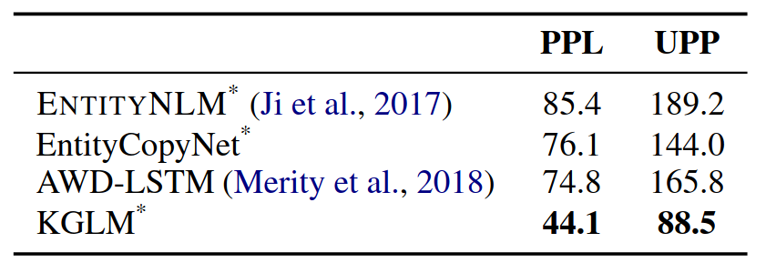
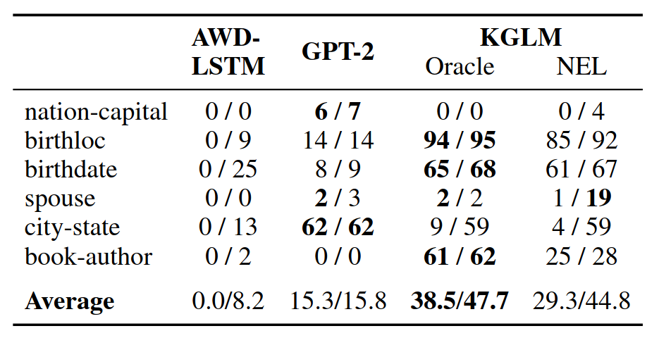

# Overview

- Language modelling
- - Sentence completion using factual knowledge
- - Explicit information access
- Knowledge graph language model
- - Definition
- - Example
- - Computation
- - Training and inference
- Experiments
- - Language modelling
- - Fact completion
- Future work

# Language Modelling

Next word completion:

- `Super Mario Land is a 1989 video game developed and ____`

. . .

Fluency:

> - `Super Mario is a 1989 video game developed and published by ____`

. . .

Adequacy / Basic reasoning:

> - `Super Mario is a 1989 video game developed and published by Valve`
> - _Valve_ is an entity that could potentially develop and publish a video game
> - Founded in 1996    

. . .

Factual correctness:

> - `Super Mario is a 1989 video game developed and published by Nintendo`

# Language Modelling

Achievements:

> - Fluency? Yes - even n-gram models
> - Adequacy? Yes - BERT derivatives
> - Factual correctness?
> - - BERT derivatives (stored in the parameters)
> - - Explicit information structure (KG)

# Explicit information access

Advantages:

> - Language model and database separate \newline
    adding information without retraining LM 
> - Performance on unseen/rare entities
> - Explainability

. . .

Control:

> 1. Prompt: `Barack is married to ___`
> 2. Reponse: `Barack is married to Michelle`
> 3. *Change the entity in the KG
> 4. Reponse: `Barack is married to Hillary`

. . .

Disadvantages:

- Research and mass adoption missing
- Two components to setup and maintain

\note{
  - A big advantage is being able to modify facts after the language model training. This is not possible for standard language models, because the facts are stored in the trained parameters - in their generative ability. With separate structures, it is possible to verify that changing the relevant entry will yield different generative results.

  - Control is something not immediately useful in LM, but may be in downstream tasks. It also neatly shows the dependence between the model and the knowledge base.
}

# Knowledge Graph Language Model

::: columns
:::: column
Components:

- Standard language model
- External knowledge graph
- Local knowledge graph (subset of ^) 
- - For mentioned entities
::::

. . .

:::: column
Actions:

- Not an entity
- Generating new entity:
- - Access external
- - Add to local
- - Render
- Generating encountered entity
- - Access local
- - Render
::::
:::

\note{
  - Standard LM, like BERT, which will be slightly modified
  - External knowledge base
  - - From which we will keep a subset, called local knowledge graph

  - At every token the model can decide between three actions:
  - Not an entity - fallback to standard model
  - Generate new entity - retreives the entity from the external graph
  - Generate a related entity - can be found in the local graph
}

# LM + KG

> - Standard LM: \newline
  $p(x_t|x_{< t}) = \text{softmax}(W_h h_t + b_h), h_t = \text{LSTM}(h_{t-1},x_{t-1})$
> - Knowledge graph: \newline
  $\mathcal{KG} = \{(\text{parent}, \text{relation}, \text{entity})| \text{parent, entity} \in \mathcal{E}, \text{relation} \in \mathcal{R}\}$
> - Local knowledge graph: \newline
  $\mathcal{KG}_{< t}$ entities participating in first $t$ tokens
> - LM + KG: \newline
  $p(x_t, \mathcal{KG}_t|x_{< t}, \mathcal{KG}_{< t})$
> - Decision/type of token $t: t_t \in \{\emptyset, \text{new}, \text{related}\}$

\note{
    New entity mention, new entity, related entity
}

# LM + KG

Decision/type of token $t: t_t$

- $t_t = \emptyset$: choose $e_t = \emptyset$

. . .

- $t_t = \text{new}$: choose $e_t \in \mathcal{E}$

. . .

- $t_t = \text{related}$: \newline
    choose $\text{parent}_t \in \mathcal{E}_{< t}$ \newline
    choose $\text{relation}_t \in \{r|(\text{parent}_t, r, e) \in \mathcal{KG}_{< t}\}$ \newline
    choose $\text{entity}_t \in \{e|(\text{parent}_t, \text{relation}_t, e) \in \mathcal{KG}_{< t}\}$
  
. . .

Update local KG: $\mathcal{E}_{< t+1} = \mathcal{E}_{< t+1} \cup \{e_t\}$ 

# Linked WikiText-2

::: columns

:::: column

1. Entity recognition
2. Coreference using Stanford CoreNLP
3. Wikipedia links + neural-el entity linker
4. Sequentially parse tokens and create local KGs
5. Rule-based post-processing (dates, quantities, entities)

::::

:::: column
{width=95%}
::::
:::

\note{
  - Data hard to come by
  - Derivative of WikiText-2
  TODO comment
}

# Example

{width=100%}

# Computation - Picking $e_t$

$h_t = [h_{t,x};h_{t,p};h_{t,r}]$\newline
$t_t = \text{softmax}(W_t h_{t,x} + b_t)$ 

. . .

$t_t = \text{new:}$

- $e_t = \text{softmax} (v_e\cdot (h_{t,p}+h_{t,r}))$

. . .

$t_t = \text{related:}$

- $p_t = \text{softmax}(v_p\cdot h_{t,p})$
- $r_t = \text{softmax}(v_r\cdot h_{t,r})$ (restricted by $p_t$)
- $e_t \in \{e|(\text{parent}_t, \text{relation}_t, e) \in \mathcal{KG}_{< t}\}$

\note{
  - Ideally, the combination of parent and relation fully determines the entity. If there are multiple, one is chosen at random.
  - QUESTION: The paper does not mention what happens if this set is empty. Probably fallback to LM?
}

# Computation - Rendering $e_t$

$e_t = \emptyset$:

- standard LM ($softmax(W_h h_t + b)$)

. . .

$e_t \in \mathcal{E}$:

> - $h_t' = W_\text{proj}[h_t;v_{e_t}]$
> - $p_\text{orig}(x_t = w_t) = softmax (W_h h_t' +b)$
> - $p_\text{alias}(x_t = a_j) \propto \exp \big[\sigma\big( {h_t'}^{T} W_\text{copy}\big)\cdot a_j\big]$

. . .

Marginalize $p(x_t) = \sum_{\mathcal{E}_t} p(x_t, \mathcal{E}_t)$

\note{
    - Split hidden state to word, parent and relation.
    - For perplexity we care about the probability of the produced token, therefore we marginalize the distribution.
    - This may not be obvious why we do it, but the construction of the local graph is also statistical. So even though we could still just take the argmax at every step, that would not be the correct distribution as described by this model. Therefore we need to marginalize by all possible local graphs. Later we will see how to approximate this.
}

# Training, Inference

Training:

::: columns
:::: column
- Loss function: $\sum \log p(x_t, \mathcal{E}_t | x_{< t}, \mathcal{E}_{< t}, \Theta)$

. . .

- Marginalize over parents
::::
:::: column
{width=100%}
::::
:::

. . .

Inference

- $p(x) = \sum_\mathcal{E} p(x, \mathcal{E})$ hard to compute
- $p(x) = \sum_{\mathcal{E}} \frac{p(x_t, \mathcal{E}_t)}{q(\mathcal{E}_t|x_t)}\cdot q(\mathcal{E}_t|x_t) \approx \frac{1}{N} \sum_{\mathcal{E} \sim q} \frac{p(x_t, \mathcal{E}_t)}{q(\mathcal{E}_t|x_t)}$ 

\note{
  - $q$ is a proposal distribution made by a model, that just predicts the parents, entities and relationships given the unmasked token
  - This process is called importance sampling
}

# Pretrained Embeddings

$p$-parent, $r$-relation, $e$-entity\newline
$p'$-randomly sampled entity, $e'$-randomly sampled entity,

. . .

$\delta(v_p, v_r, v_e) = ||v_p + v_r - v_e||^2$

. . .

Hinge loss (extended): $\mathcal{H} = \sum_{y\ne t} \max (0, 1+w_y x - w_t x)$

. . .

For embeddigs: $\mathcal{L} = max(0, \gamma + \delta(v_p, v_r, v_e) - \delta(v_{p'}, v_r, v_{e'}))$

\note{
  - For the pretrained embeddings, the authors use modified hinge loss.
  - Normally it's summed over all possible classes, which is not possible here. So two random  entities are used to prevent collapes (in that case $\mathcal{L} = \gamma$).
}


# Experiments - Language Modeling

Perplexity

- geometric average probability of the all data: \newline
  $p(x_1, x_2, x_3, \ldots)^{1/T} = exp(\frac{1}{T} \sum_1^T log p(x_t))$

Unknown penalized perplexity

> - What about `<UNK> <UNK>'s wife is <UNK> <UNK>`?
> - $\mathcal{U} = \{t|f(t) =\texttt{<UNK>}\}$
> - $p'(\texttt{<UNK>}) = \frac{1}{|\mathcal{U}|} p(\texttt{<UNK>})$
> - Compute perplexity on $p'$

\note{
  - Standard perplexity is not the best metrics for texts containing named entities: predicting unknown/unseen words as `<UNK>` yields good results, even though no information is transferred.
  - Solution would be to penalize predicting `<UNK>` more than other tokens.
  - Distribute the predicted probability among all tokens that map to `<UNK>`
}

# Experiments - Language Modeling

{width=55%}

# Experiments - Fact completion


# Experiments - Fact completion

|**Parent**|**Relation**|**Entity**|
|:-|:-|:-|
|India|nation-capital|New Delhi|
|Madonna|spouse|Kim Kardashian|
|Paris Hilton|birthloc|New York|
|Paris Hilton|birthdate|1981-02-17|

. . .

::: columns
:::: column
|**Query**|
|:-|
|Paris Hilton was born in `___`|
|Arnold Schwarzenegger was born on `___`|
::::

. . .

:::: column
|**Gold**|**GPT-2**|**KGLM**|
|:-|:-|:-|
|New York City|New|1981|
|1947-07-30|July|30|
::::
:::

# Experiments - Fact completion

{width=65%}

# Future Work

> - Better system from choosing out of multiple entities (entity rendering).
> - Marginalization approximated during inference
> - Specific knowledge graph annotation

# References

Research content and all figures:

```
@article{logan2019barack,
  title={Barack's Wife Hillary: Using Knowledge-Graphs for
    Fact-Aware Language Modeling},
  author={Logan IV, Robert L and Liu, Nelson F and Peters, Matthew E
    and Gardner, Matt and Singh, Sameer},
  journal={arXiv preprint arXiv:1906.07241},
  year={2019}
}
```